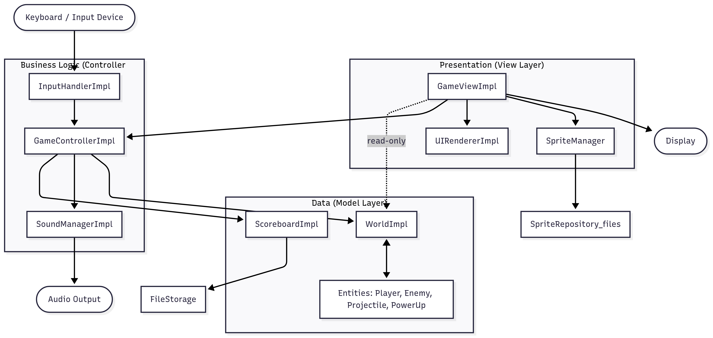
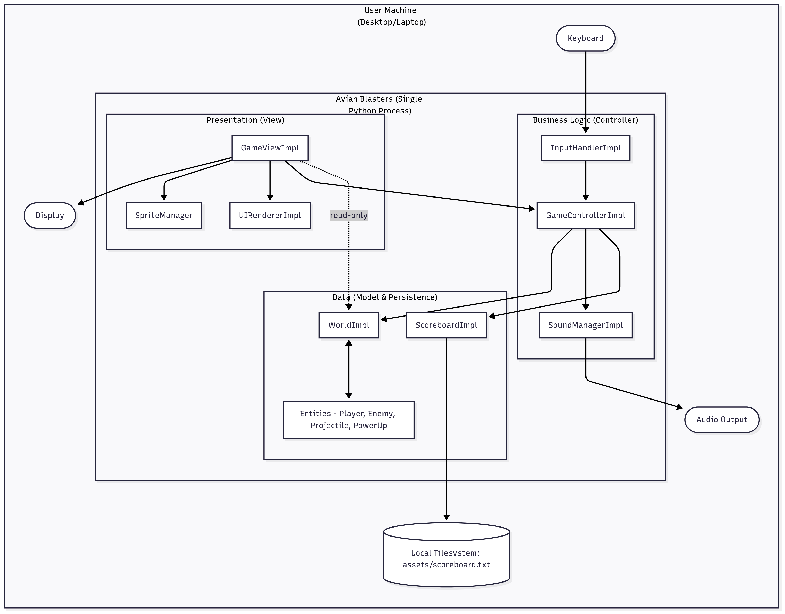
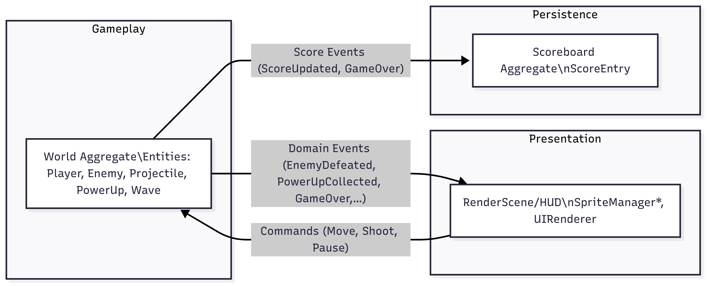
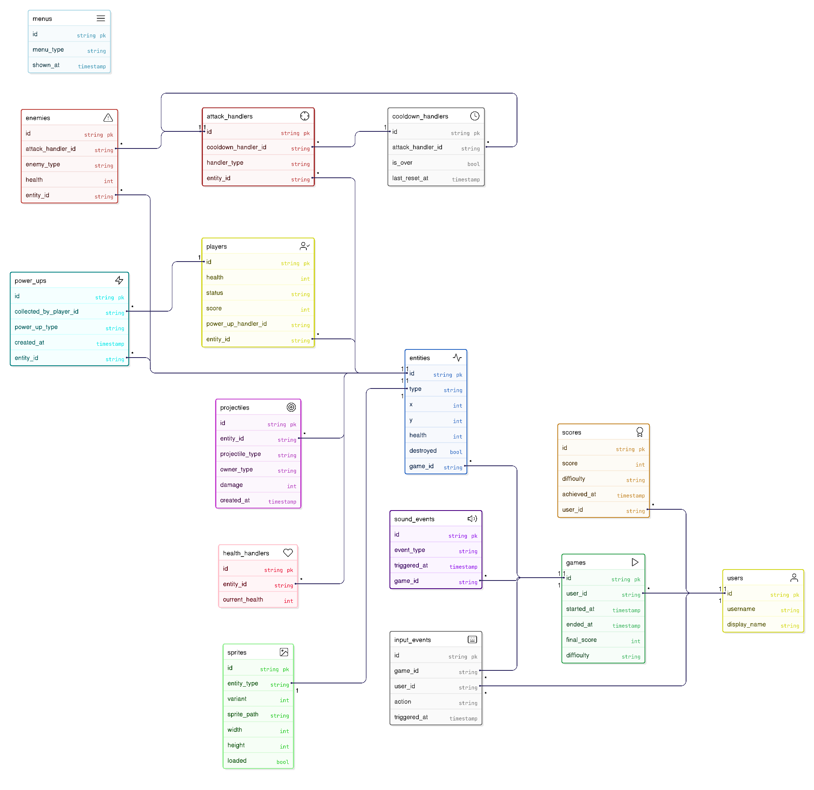

# Design

This chapter explains the strategies used to meet the requirements identified in the analysis. 

Ideally, the design should be the same, regardless of the technological choices made during the implementation phase.

> You can re-order the sections as you prefer, but all the sections must be present in the end

## Architecture 

- Which architectural style (e.g. layered, object-based, event-based, shared dataspace)? Why? Why not the others?
- Provide details about the actual architecture (e.g. N-tier, hexagonal, etc.) you are going to adopt. Motivate your choice.
- Provide a high-level overview of the architecture, possibly with a diagram
- Describe the responsibilities of each architectural component

> UML Components diagrams are welcome here

### Architectural Style

We adopt a layered architecture with object-oriented design. This choice provides:

- Separation of concerns: clear boundaries between presentation, game logic, and data/persistence.

- Maintainability and testability: each layer has focused responsibilities and can be tested in isolation.

- Evolutionary flexibility: UI, rules, and storage can evolve independently with stable interfaces.

Why not other styles?

- Event-based: It would add unnecessary complexity for a single-player game with straightforward game loop.

- Shared dataspace: It is not suitable for a game requiring real-time updates and state management

- Microservices: It is overkill for a single-player desktop application

### Detailed Architecture: N-Tier with MVC Pattern

The architecture is based on a 3-tier model (Presentation, Business Logic, and Data) with the Model-View-Controller (MVC) pattern implemented at the boundary between the Presentation and Business Logic tiers. This design ensures a clear separation of concerns, decoupling rendering (View) from orchestration (Controller) and state management (Model). This inward-pointing dependency structure (UI → Controller → Model) enables robust unit testing of controllers and models without needing a renderer and facilitates the easy substitution of components like different renderers or storage systems with minimal impact. The architecture aligns seamlessly with a real-time game loop while maintaining its clean, modular structure.

### Responsibilities of architectural components

- GameViewImpl / SpriteManager* — compose and render frames; manage sprites/animations; draw HUD via UIRendererImpl.

- GameControllerImpl — main loop, input coordination, state updates, audio triggers; InputHandlerImpl maps device events to commands.

- WorldImpl — authoritative game state and entity lifecycle (Player, Enemies—Bird/Bat, Projectiles, PowerUps); ScoreboardImpl persists scores (local file).

> See Modelling → Object-oriented modelling for class details; see Modelling → DDD for bounded contexts and domain events.

## Infrastructure (mostly applies to distributed systems)

- Are there **infrastructural components** that need to be introduced? Which and **how many** of each?
    - e.g. **clients**, **servers**, **load balancers**, **caches**, **databases**, **message brokers**, **queues**, **workers**, **proxies**, **firewalls**, **CDNs**, etc.
- How do components **distribute** over the network? **Where** are they located?
    - e.g. do servers / brokers / databases / etc. sit on the same machine? on the same network? on the same datacenter? on the same continent?
- How do components **find** each other?
    - How to **name** components?
    - e.g. **DNS**, **service discovery**, **load balancing**, etc.

> UML deployment diagrams are welcome here

### Infrastructural Components

Avian Blasters is a standalone, single-player desktop application that runs entirely on the user's machine in a single Python process. There are no network protocols or external services involved; persistent data is limited to the local scoreboard file. 

### Component Distribution (Network and Placement)

- All components (presentation, game logic, persistence) execute on the same host (desktop/laptop).
- Single process, in-memory collaboration via direct method calls/objects.
-No inter-machine distribution; no servers, brokers or databases deployed remotely.
-Local filesystem only; scoreboard persisted to a text file (e.g., assets/scoreboard.txt).

### Component Discovery

Since all components exist within the same process and memory space, they communicate through direct method calls and object references. No service discovery, DNS, or load balancing is required. 

### Naming of Components

Standard Python module and class naming conventions are used. 

- Modules: snake_case (e.g., game_controller_impl.py, sprite_manager_enemy.py)

- Classes: PascalCase (e.g., GameControllerImpl, SpriteManagerEnemy)

- Methods: snake_case (e.g., update_game_state(), render_world())

- Files/Assets: relative paths within the project (e.g., assets/scoreboard.txt, sprite atlases).

## Modelling

### Domain driven design (DDD) modelling

- Which are the bounded contexts of your domain? 
- Which are domain concepts (entities, value objects, aggregates, etc.) for each context?
- Are there repositories, services, or factories for each/any domain concept?
- What are the relavant domain events in each context?

> Context map diagrams are welcome here

#### **Bounded Contexts**

We partition the domain into three bounded contexts:

**1. Gameplay Context (Core Domain)** : rules, mechanics, entities, collisions, waves.

**2. Presentation Context (Supporting Subdomain)** : rendering, HUD, animations, view models.

**3. Persistence/Scoring Context (Generic Subdomain)** : durable high-scores and related queries.

#### **Context relationships (high level):**

- Gameplay → Presentation: Gameplay publishes domain events that the Presentation consumes to render the current state.

- Gameplay → Persistence: Gameplay emits score-related events; Persistence records and queries them.

- Presentation → Gameplay: User input is translated into commands directed at Gameplay.

#### **Domain Concepts per Context**

**1. Gameplay Context (Core Domain)**

**Aggregate roots and aggregates**

- World (aggregate root): authoritative state and lifecycle of in-world objects. 
Invariants: exactly one Player; entities must be registered through the world; collisions are resolved at most once per tick; projectiles have owners and TTL.

**Entities (inside World)**

- Player : health, position, score buffer, active powerups.

- Enemy : base type with variants (Bird, Bat);Health, position, movement state, attack cooldown

- Projectile: owner (player/enemy), type, damage, direction, TTL

- PowerUp: type, duration/effect.

- Wave: formation pattern, remainig enemies, spawn cadence. 

**Value Objects**

- Position (x,y), Velocity, Direction; Bounding Box/ Area (Collision)
- Health (current,max); Damage; Score (non-persistent, in-run points)
- Types (EnemyType, ProjectileType, PowerUpType); TimeStep dt.

**Domain Services**
- Collision Service: Collision detection and resolution across aggregates.
- Spawn Service: Schedles/mints enemies and waves according to rules.
- Scoring Services: Converts in-run events to score deltas (pre-persistence).

**Factories**
- EnemyFactory, ProjectileFactory, PowerUpFactory,WaveFactory: create valid instances honoring invariants.

**Repositories**
- WorldRepository (in-memory): snapshot/load transient world state (useful for testing, pausing).

**Domain Events**
- GameStarted, ProjectileFired, EnemySpawned, EnemyDefeated
- PlayerDamaged, PlayerDied, PowerUpCollected, WaveCompleted, GameOver.

**2. Presentation Context (Supporting)**

It transform domain state/events into frames, HUD, and feedback without altering rules.

**Aggregates/Entities**

- RenderScene (aggregate root): currect frame graph (layers, camera, UI).
- SpriteManager* : sprite/animation resources per entity family.
- UIOverlay/HUD: health, score, game over, pause.

**Value Objects**

- Spriteld, Frame, Animation, Viewport, Color, Dimensions, TextLabel. 

**Services**

- RenderingService: composes scene graph from domain read models.
- AnimationService: advances sprite timelines.

**Repositories**

- SpriteRepository: file based asset catalogue.

**Domain Events**

- EntityAppeared/Updated/Removed, HealthChanged,ScoreUpdated, GameStateChanged.

**3. Persistence/Scoring Context (Generic)**

**Aggregate roots and aggregates**

- Scoreboard (aggregate root): collection of ScoreEntry.

**Entities**

- ScoreEntry: (PlayerName, points, difficulty, timestamp).

**Value Objects**

-ScorePoints, PlayerName, Difficulty, RecordedAt.

**Services**

- ScoreboardService; Manages score persistence

**Repositories**

- ScoreboardRepository : file-backed storage (e.g., assets/scoreboard.txt).

**Domain Events (handled/emitted)**

- ScoreAdded: When a new high score is recorded.
- ScoreboardLoaded:  When scores are retrieved from storage.

#### **Context Map**

**Upstream/Downstream and Translation Patterns**

- Gameplay is upstream to both Presentation and persistence (it owns the domain language and publishes events).
- Presentation is downstream conformist: it adopts Gameplay's published language and translates events into view models.
- Persistence is downstream via an open-host/published language: it listens to score-related events and persists them.
- Presentation → Gameplay uses an ACL (anti-corruption layer) for input: UI terms (keys, buttons) are translated into commands (Moveleft, shoot, pause). 

### Object-oriented modelling

- What are the main data types (e.g. classes) of the system?
- What are the main attributes and methods of each data type?
- How do data types relate to each other?

> UML class diagrams are welcome here

This section provides the system's principal classes, their responsibilities, salient attributes/methods, and the relationships among them. The modelling aligns with the layered (Presentation/ Business Logic/ Data) + MVC architecture descibed in the previous sections. 

#### Main data types (classes)

#### **Core domain (gameplay)**

- Entity (Abstract Base) / EntityImpl (Concrete Implementation)
  Responsibility: minimal game object contract (identity, spatial footprint, lifecycle).
  Key attributes: _area , _type, _active
  Key methods: get_area(), get_type (), move(dx,dy,width,height), destroy(), is_active()

- Character (Abstract Base) / CharacterImpl (Concrete Implementation)
  Responsibility: movable, damageable actors with attacks.
  Key attributes: _health_handler, _attack_handler , _speed, _position , _area 
  Key methods: get_health(), take_damag(amount), is_dead(), shoot(), move()

- Player (Abstract Base) / PlayerImpl (Concrete Implementation)
  Responsibility: user-controlled character.
  Key attributes: _score , _status_handler , _power_up_handler , _limit_left , _limit_right 
  Key methods: move(direction), shoot(),is_touched(other),ger_score() 

- Enemy (Abstract Base) / EnemyImpl (Concrete Implementation), Bird, Bat
  Responsibility: opponents with variant behaviors.
  Representative attributes:
  EnemyImpl: Inherits from Character and Enemy + _laser_damage_timer;
  Bird: _formation_direction, _horizontal_accumulator, _vertical_accumulator;
  Bat: _movement_state, _player_y, _horizontal_direction.
  Key methods: shoot(), move(), set_player_position (y).

- Item (Abstract Base) / ItemImpl (Concrete Implementation)
  Responsibility: base for non-actor interactables (projectiles, power-ups).

- Projectile (Abstract Base) / ProjectImpl (Concrete Implementation)
  Responsibility: time-limited damaging entities.
  Key attributes: _projectile_type, _damage
  Key methods: get_projectile_type(), get_damage(), move()

- PowerUp (Abstract Base) / PowerUpImpl (Concrete Implementation)
  Responsibility: temporary effects applied to the player.
  Key attributes: _power_up_type, _duration.
  Key methods: get_power_up_type(), apply(player), remove(player).

- HealthHandler (Abstract Base) / HealthHandlerImpl (Concrete Implementation)
  Responsibility: encapsulate health arithmetic and invariants.
  Key attributes: _max_health, _current_health.
  Key methods: take_damage(amount), heal(amount), is_dead(), get_current_health().

- AttackHandler (Abstract Base) / GeneralAttackHandlerImpl (Concrete Implementation), EnemyAttackHandler, PlayerAttackHandler
  Responsibility: fire-rate/cooldown logic and projectile creation.
  Key attributes: _cooldown_handler, _fire_chance.
  Key methods: try_attack(), update(dt), set_player_position(y).

- World (Abstract Base) / WorldImpl (Concrete Implementation)
  Responsibility: aggregate root for in-game state and entity lifecycle.
  Key attributes: _entities.
  Key methods: get_all_entities(), add_entities(*entities), get_players(), get_enemies(), remove_entity(entity).

#### **Application / presentation support**

- GameController (abstract) / GameControllerImpl
  Responsibility: game loop orchestration and coordination among layers.
  Key attributes: _world, _view, _input_handler, _player.
  Key methods: initialize(), run(), update_game_state(dt), handle_input().

- InputHandler (→ InputHandlerImpl)
  Responsibility: translate device input into domain commands.
  Key methods: handle_events(), process_input().

- SoundManager (→ SoundManagerImpl)
  Responsibility: SFX/music playback.
  Key methods: play_sound_effect(id), play_music(track).

- SpriteManager (abstract) / AbstractSpriteManager with specializations
  Responsibility: sprite/animation loading and draw calls for entity families.

- UIRenderer (→ UIRendererImpl)
  Responsibility: HUD and overlay rendering (score, health, game-over).
  Key methods: render_score(), render_health(), render_game_over().

#### **Persistence**

- Scoreboard (→ ScoreboardImpl)
  Responsibility: durable high-score collection.
  Key methods: add_score(player, value), get_scores(); file-backed (assets/scoreboard.txt).

#### Relationships among data types

**- Inheritance**

- Character is-a Entity; Player is-a Character; Enemy is-a Character; Bird/Bat are Enemy.
- Item is a base for Projectile and PowerUp (with concrete implementations).

**- Composition**

- Character has-a HealthHandler and AttackHandler.
- Player has-a StatusHandler, PowerUpHandler, and Score.
- World has collections of Entity (players, enemies, projectiles, power-ups).

**- Association / Dependency**

- GameController → World, InputHandler, UIRenderer, SoundManager, Scoreboard.
- SpriteManager uses Entity state to render; UIRenderer reads world/score state.
- EnemyAttackHandler and PlayerAttackHandler create Projectile instances (via factories).

**- Factories (creational)**

- EnemyFactory → Bird, Bat; ProjectileFactory → Projectile (e.g., SoundwaveProjectile); PowerUpFactory → PowerUp.

### In case of a distributed system

- How do the domain concepts map to the architectural or infrastuctural components?
    + i.e. which architectural/component is responsible for which domain concept?
    + are there data types which are required onto multiple components? (e.g. messages being exchanged between components)

- What are the domain concepts or data types which represent the state of the distributed system?
    + e.g. state of a video game on central server, while inputs/representations on clients
    + e.g. where to store messages in an instant-messaging app? for how long?

- Are there domain concepts or data types which represent messages being exchanged between components?
    + e.g. messages between clients and servers, messages between servers, messages between clients

## Interaction

- How do components *communicate*? *When*? *What*?

- Which **interaction patterns** do they enact?

> UML sequence diagrams are welcome here

This section explains how components communicate, when, and what they exchange, and the interaction patterns they enact.

### Component Interaction

This section details the nature of communication and data exchange among the system's components, which is critical for the game's operational integrity.

#### **Communication Modality**

Components interact via synchronous Python method calls and object references within a single process. The View reads the Model’s state in a read-only fashion; the Controller orchestrates updates and coordinates subsystems (rendering, audio, persistence). No network messages are used.

#### **Timing and Frequency of Interaction**

Component interactions are triggered by specific events and occur at predetermined intervals to maintain the real-time nature of the game:

- Game loop tick: The primary communication occurs once per frame during the game loop tick, targeting a rate of 60 frames per second.

- Event-Driven Communication: Interactions are initiated immediately in response to new **user input events** and during significant **state transitions**, such as object collisions, entity destruction, or the activation/deactivation of power-up effects.

- Lifecycle Events: Communication is also vital during the application's initialization and shutdown phases to facilitate proper setup and teardown of components.

#### **Exchanged Data**

The data exchanged between components can be categorized into several distinct types, reflecting their purpose and origin:

- Control Signals: These include commands and actions derived from user input, such as instructions to move, shoot, or toggle game states (e.g., pause/quit).

- State Updates: Information representing changes in the game world, including positions, health values, spawns, despawns, and management of timers and cooldowns.

- Presentation Data: Information specifically formatted for rendering, such as entity lists, derived view information, and values for the Head-Up Display (HUD).

- System Cues: This category includes audio cues (e.g., for firing or impact sounds) and persistence data related to score submissions and queries to the local scoreboard.

