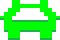

# User Guide

This section explains how to use the software (from the user perspective, and assuming that it has been correctly deployed/installed).

> Screenshots are welcome, but please make sure to remove any sensitive information (e.g. passwords, tokens, etc.) before including them in the documentation.

## Table of Contents

- [Starting Up](#starting-up)
- [Controls](#controls)
    - [Menus](#menus)
    - [Game](#game)
- [Story](#story)
- [Characters](#characters)
    - [Secondary Characters](#seconday-characters)
- [Main Menu](#main-menu)
    - [Name](#name)
    - [Play](#play)
    - [Difficulty](#difficulty)
    - [FPS](#fps)
    - [Scoreboard](#scoreboard)
    - [Reset](#reset)
    - [Quit](#quit)
- [Scoreboard Menu](#scoreboard-menu)
- [Gameplay](#gameplay)

## Starting up

After a correct installation, when loaded up the main menu of the game will present itself.

## Controls

### Menus
Both the keyboard and the mouse can be used to navigate the menus.

### Game

| Button/Key | Action |
|------------|--------|
|LEFT arrow (or A) | Move the car left |
|RIGHT arrow (or D) | Move the car right |
|Space bar | Shoot |
|Right shift | Pause/Unpause |
|ESC | Quit the game and return to the menu |

## Story

**People of Earth, beware the Avians have returned, and this time they mean business!**

Once before the creatures of planet Earth were able to fend off the Avian invasion. 

This would not go unnoticed by the Avians' commander, the mighty General Pigeon O'Dovell.

Considering the outragous and humiliating defeat, the enemy general went to steps no one could have possibly foreseen to trump us: he got some new allies, the Bats, the historical broody rivals of the Birds who have the power to slow down their foes with their sound waves.

Now the Avians have returned to planet Earth and they are bigger, faster, and stronger too. Both Bird and Bat flocks want to defeat the Eartlings by whatever means necessary.

We require now, more than ever, your assistance Mr. Odie.

Your mission, should you choose to accept it, is to distract the Avians using your car, the Jolly Runner, so that we can defeat them once and for all by sending them to a dimension where they will not antagonise us anymore through all their staining... well they could still ruin someone else's day, but not ours, so it checks out... right?

Anyway, we know you can not get your newly improved Jolly Runner can not withstand their attacks without staining it irreparably, but thorugh the use of your weaponry and of the items we will give you during the fight, you should be able to assist us in our desperate attempt to defend the Earth.

Help us Mr. Odie, you are our only hope.

*General Pfeffer*

## Characters

**Mr. Odie**: what many would call the unexpected guy at the unexpected time. A normal guy who ends up in odd situations and magaes to find a unique way out. Seems like he can not get a bad day. There is no day in which we does not enjoy a ride in his car, the **Jolly Runner**, that accompanies him in his quests, so he does his best not to stain it. Also, Odie has a partner named **Calamity Jane** with whom he goes on most of his misadventures. Apparently his first name is Ulysses, but everyone calls him Odie: likely someone does not like latinised names originating from greek myths.

**Avians**: a group comprised of various flying creatures who have a specific goal: ruining other people's day. They do this by staining, which annoys most other populations to no end more than anything. Let's say, most would not want an Avian as a neighbour, especially if you have a car parked outside.

**Birds**: the main group inside the Avians. They are the most numerous and attack in waves, so that when the enemy expects to have defeated them, a new one appears, taking them by surprise (and annoyance). Some say they are infinite, but it would take a while to test that out, would it not? They apparently like bread and croissants, but it does them no good for their glucouse, so try not to give it to them, unless you wish to have that on your resume.

image of Bird

**Bats**: a rival group to the Birds. The news of the defeat of the Avians by the Earthlings and the formal request by General O'Dovell, lead the Bats to join the Birds in their fight. They prefer to attack one at the time, hoping to take adavantage of the chaos created by the Birds to slow down the opponents so that the other Avians can strike them more swiftly. Although they live in the shadows, they do not mind getting a tan on the beach, while getting a nice triple chocolate and pistacchio ice-cream cone every so often. Fun fact: some say that Bats are just Birds upside down, much like clouds and bushes or something like that.

image of Bat

### Seconday Characters

**General Pigeon O'Dovell**: the leader of the Avians. His greatness in the Avian world is second to none. Someone who never lost, or at least that is what he says. Surprisingly, the general is very forgiving to his troops and wants the Avians' prosperity. He rarely joins in battle as he considers himself the last resort of the Avians. In the past he had a rivalry with **Bat McNimbus**, the leader of the Bats. Fun fact: he is a well-known enjoyer of French cousine.

**General Pfeffer**: the leader of the Earthling forces fending off the Avians. He often relies on Mr. Odie and Calamity Jane in the weirdest situations: for example he called them last week so they could tell him how to prepare green tea. Despite his clumsiness, he still magaes to be very organised and leads his forces to great effect, providing input for some items they develop, like the so called Power-Ups. According to rumors, his reason for fighting is due to some Avians staining his car and his shirt before a date, which would not be the first (or the last) time this has happened to an Earthling.

## Main Menu

In the menu, the following options can be found:
 
### Name:
Allows the user to input a name so that the score can be added onto the scoreboard as the game ends.

**PLEASE NOTE**: if no name is selected the score will not be saved!

### Play:
Starts up the game Avian Blasters proper using the currently selected name, difficulty and fps.

### Difficulty:
Allows the user to choose the level of difficulty they wish. It goes from **Easy Peasy** (Easy), to  **Typical ride** (Normal) and finally to **Hard as nails** (Hard).

**REMEMBER**: As the difficulty increases, the amount of health points the Player character has decreases.

### FPS:
Allows the user the refresh rate of the game. The possible options are **Smooth 60**, **Typical 30** and **Rough 15** fps.

### Scoreboard:
Allows the user access a submenu showing the Scoreboard.

### Reset:
Resets the Scoreboard to a default one.

**PLEASE NOTE**: this change is irreversible!

### Quit:
Closes the game in its entirety.

## Scoreboard Menu
If Scoreboard is selected this menu will appear:

The scoreboard shows 4 elements per entry:
1. **Rank**
2. **Name** of the player
3. **Score** gathered
4. **Difficulty** selected

By default the highest scores will be highlighted, but by pressing the **Higher scores** or the **Lower scores** button, another set of higher or lower scores can be seen, if present.

The **Go Back** button is used to return to the main menu.

## Gameplay

