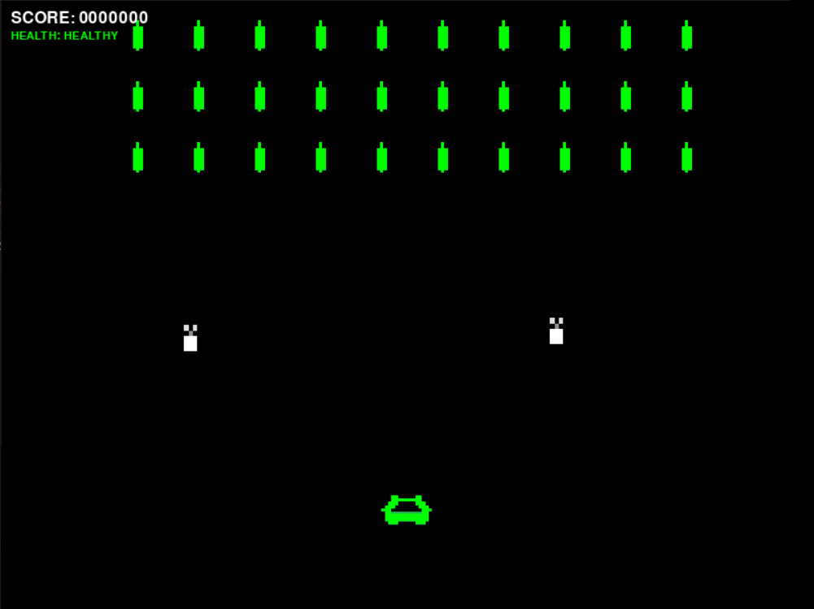
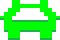
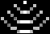

# User Guide

# Avian Blasters: The Avians Strike Back!

## Table of Contents

- [Starting Up](#starting-up)
- [Controls](#controls)
    - [Menus](#menus)
    - [Game](#game)
- [Story](#story)
- [Main Menu](#main-menu)
- [Scoreboard Menu](#scoreboard-menu)
- [Gameplay](#gameplay)
    - [Car states](#car-states)
    - [Avians](#avians)
    - [Power-Ups](#power-ups)
    - [Projectiles](#projectiles)
- [Characters](#characters)
    - [Secondary Characters](#seconday-characters)
- [Credits](#credits)

## Starting up

After a correct installation, when loaded up the main menu of the game will present itself.

## Controls

### Menus
Both the keyboard and the mouse can be used to navigate the menus.

### Game

| Button/Key | Action |
|------------|--------|
|LEFT arrow (or A) | Move the car left |
|RIGHT arrow (or D) | Move the car right |
|Space bar | Shoot |
|Right shift | Pause/Un-pause |
|ESC | Quit the game and return to the menu |

## Story

**People of Earth, beware the Avians have returned, and this time they mean business!**

Once before the creatures of planet Earth were able to fend off the Avian invasion. 

This would not go unnoticed by the Avians' commander, the mighty General Pigeon O'Dovell.

Considering the outrageous and humiliating defeat, the enemy general went to steps no one could have possibly foreseen to trump us: he got some new allies, the Bats, the historical broody rivals of the Birds who have the power to slow down their foes with their sound waves.

Now the Avians have returned to planet Earth and they are bigger, faster, and stronger too. Both Bird and Bat flocks want to defeat the Earthlings by whatever means necessary.

We require now, more than ever, your assistance Mr. Odie.

Your mission, should you choose to accept it, is to distract the Avians using your car, the Jolly Runner, so that we can defeat them once and for all by sending them to a dimension where they will not antagonise us anymore through all their staining... well they could still ruin someone else's day, but not ours, so it checks out... right?

Anyway, we know you can not get your newly improved Jolly Runner can not withstand their attacks without staining it irreparably, but through the use of your weaponry and of the items we will give you during the fight, you should be able to assist us in our desperate attempt to defend the Earth.

Help us Mr. Odie, you are our only hope.

*General Pfeffer*

## Main Menu

 
### Name:
Allows the user to input a name so that the score can be added onto the scoreboard as the game ends.

**PLEASE NOTE**: if no name is selected the score will not be saved!

### Play:
Starts up the game Avian Blasters proper using the currently selected name, difficulty and fps.

### Difficulty:
Allows the user to choose the level of difficulty they wish. It goes from **Easy Peasy** (Easy), to  **Typical ride** (Normal) and finally to **Hard as nails** (Hard).

**REMEMBER**: As the difficulty increases, the amount of health points the Player character has decreases.

### FPS:
Allows the user the refresh rate of the game. The possible options are **Smooth 60**, **Typical 30** and **Rough 15** fps.

### Scoreboard:
Allows the user access a submenu showing the Scoreboard.

### Reset:
Resets the Scoreboard to a default one.

**PLEASE NOTE**: this change is irreversible!

### Volume:
Allows the user to activate or deactivate the music and sound effects of the game.

### Quit:
Closes the game in its entirety.

## Scoreboard Menu
If Scoreboard is selected this menu will appear:

The scoreboard shows 4 elements per entry:
1. **Rank**
2. **Name** of the player
3. **Score** gathered
4. **Difficulty** selected

By default the highest scores will be highlighted, but by pressing the **Higher scores** or the **Lower scores** button, another set of higher or lower scores can be seen, if present.

The **Go Back** button is used to return to the main menu.

## Gameplay

Mr. Odie in his trusted Jolly Runner must fend off the Avians for as long as possible by:
1) dodging enemy attacks.
2) attacking with the car's projectiles.
3) taking advantage of the power-ups offered by general Pfeffer and his forces.

The Jolly Runner will be defeated if:
1) it is hit when its colour is red
2) if an Avian touches it

During the game the following will be shown:
- The current score on the top left
- The current health of the car in the top left

### Car states

**Green**: the Jolly Runner can be hit thrice before irreparable damage is done to it. Starting colour on easy difficulty. It is accessible only on the easiest difficulty setting.

**Yellow**: the Jolly Runner can be hit twice before irreparable damage is done to it. Starting colour on medium difficulty. It is accessible only on the medium and the easy difficulty settings.

**Red**: be careful! One more hit and, not only Jolly Runner will never be the same again, but also the game will end. Starting colour on hard difficulty.

**Grey**: the Jolly Runner has been hit, and it is invulnerable to damage for a brief time.

**Blue**: the Jolly Runner has collected an invulnerability Power-Up and it is completely invulnerable to enemy projectiles.

**Orange**: the Jolly Runner has collected a Power-Up enhancing its capabilities.

### Avians

**Birds**: these Pidgeon-esque creatures attack using normal projectiles and like to fly in waves (or better flocks). Their goal is to reach the Jolly Runner, causing an automatic defeat. If a wave is defeated in its entirety, a new one will appear shortly.

**Bats**: these flying mice appear once in a while to harass the Jolly Runner's progress. Although they will not try to touch the Jolly Runner, they will try to slow it down using their characteristic sound waves, so that their fellow Avians can more easily damage the poor little car.

Much like the Jolly Jumper, their health is indicated by their colour:
- Green: they need to be hit thrice
- Yellow: they need to be hit twice more
- Red: one more hit and they are defeated

Hitting and defeating Avians grants points, which will be added to the Score.

### Power-Ups

When an Avian is defeated a Power-Up might drop. It can be one of the following:

**Drop**: if the Jolly Runner collects this enhanced drop, its health will be fully recovered to the maximum allowed by the selected difficulty level.

**Star**: based off an idea of general Pfeffer, this star shaped gadget grants the Jolly Runner full invulnerability for a brief amount of time. Use it wisely!

**Laser Gun**: collecting this powerful gadget grants total annihilation of the collector's enemies. It will shoot a continuous laser for a limited amount of time. It can turn the tide quickly if used properly.

**Double Fire**: grants the Jolly Runner a double shot, allowing the attacks to cover a wider area, and more easily hit more targets.

**Careful**: by collecting a power-up, the current one's effects (besides the drop's) will be removed. Consider carefully whether it is a good idea to change power-up or not.

### Projectiles

**Normal**: the normal projectile used by the Jolly Runner and the Avians. Once it hits its target it vanishes.

**Laser**: the special projectile usable by the Jolly Runner when a Laser Power-Up has been collected. It destroys any Avian its path, but it is only temporary. **Careful**: it does not destroy enemy projectiles!

**Sound wave**: the projectile shot by Bats. If it comes in contact with the Jolly Runner, it will slow it down and make it harder to move around.

## Characters

**Mr. Odie**: what many would call the unexpected guy at the unexpected time. A normal guy who ends up in odd situations and manages to find a unique way out. Seems like he can not get a bad day. There is no day in which we does not enjoy a ride in his car, the **Jolly Runner**, that accompanies him in his quests, so he does his best not to stain it. Also, Odie has a partner named **Calamity Jane** with whom he goes on most of his misadventures. Apparently his first name is Ulysses, but everyone calls him Odie: likely someone does not like latinised names originating from Greek myths.

**Avians**: a group comprised of various flying creatures who have a specific goal: ruining other people's day and laughing about it. They do this by staining, which annoys most other populations to no end more than anything. Let's say, most would not want an Avian as a neighbour, especially if you have a car parked outside.

**Birds**: the main group inside the Avians. They are the most numerous and attack in waves, so that when the enemy expects to have defeated them, a new one appears, taking them by surprise (and never-ending annoyance). Some say they are infinite, but it would take a while to test that out, would it not? As far as we know, it could also be that the Birds themselves are few, yet immortal. They apparently like bread and croissants, but it does them no good for their glucose, so try not to give it to them, unless you wish to have that on your resume.

**Bats**: a rival group to the Birds. The news of the defeat of the Avians by the Earthlings and the formal request by General O'Dovell, lead the Bats to join the Birds in their fight. They prefer to attack one at the time, hoping to take advantage of the chaos created by the Birds to slow down the opponents so that the other Avians can strike them more swiftly. Although they live in the shadows, they do not mind getting a tan on the beach, while getting a nice triple chocolate and pistachio ice-cream cone every so often. Fun fact: some say that Bats are just Birds upside down, much like clouds and bushes or something like that.

### Secondary Characters

**General Pigeon O'Dovell**: the leader of the Avians. His greatness in the Avian world is second to none. Someone who never lost, or at least that is what he says. Surprisingly, the general is very forgiving to his troops and wants the Avians' prosperity. He rarely joins in battle as he considers himself the last resort of the Avians. In the past he had a rivalry with **Bat McNimbus**, the leader of the Bats. Fun fact: he is a well-known enjoyer of French cuisine.

**General Pfeffer**: the leader of the Earthling forces fending off the Avians. He often relies on Mr. Odie and Calamity Jane in the weirdest situations: for example he called them last week so they could tell him how to prepare green tea. Despite his clumsiness, he still manages to be very organised and leads his forces to great effect, providing input for some items they develop, like the so-called Power-Ups. According to rumours, his reason for fighting is due to some Avians staining his car and his shirt before a date, which would not be the first (or the last) time this has happened to an Earthling.

## Credits

### Software Project Direction, Design and Development

- [Mariam Baloch](mailto:mariam.baloch@studio.unibo.it)

- [Beatrice Micolucci](mailto:beatrice.micolucci@studio.unibo.it)

- [Filippo Velli](mailto:filippo.velli@studio.unibo.it)

### Libraries and Templates used

- [`build`](https://pypi.org/project/build/)

- [`twine`](https://pypi.org/project/twine/)

- [`scikit-learn`](https://pypi.org/project/scikit-learn/)

- [`pandas`](https://pypi.org/project/pandas/)

- [`pygame`](https://pypi.org/project/pygame/)

- [`pygame_menu`](https://pypi.org/project/pygame-menu/)

- [`template-python-project`](https://github.com/unibo-dtm-se/template-python-project)

- [`template-project-work`](https://github.com/unibo-dtm-se/template-project-work)

### Assets

- Sprites: [Filippo Velli](mailto:filippo.velli@studio.unibo.it)

- Sounds & music from https://pixabay.com/

### Disclaimer

During the course of development (and the game proper) no Avian or Earthling was (or gets) hurt... 

... on the other hand, the cars have indeed seen stainless days.