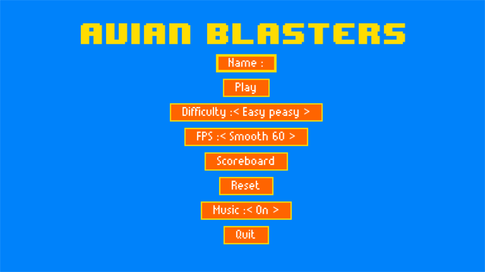
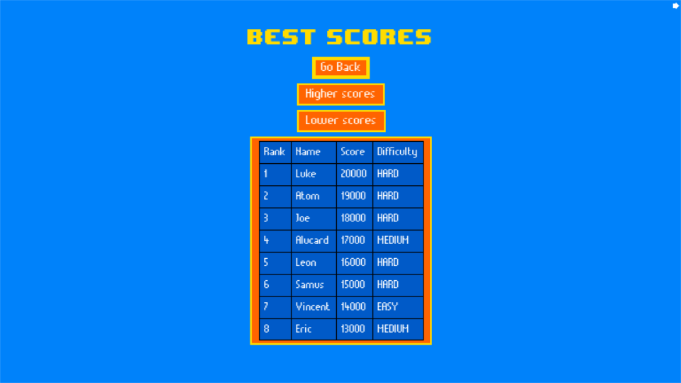

# User Guide

This section explains how to use the software (from the user perspective, and assuming that it has been correctly deployed/installed).

> Screenshots are welcome, but please make sure to remove any sensitive information (e.g. passwords, tokens, etc.) before including them in the documentation.

## Starting up

After a correct installation, when loaded up the main menu of the game will present itself.

## Controls

### Menus
Both the keyboard and the mouse can be used to navigate the menus.

### Game
LEFT arrow (or A) - Move left

RIGHT arrow (or D) - Move right

Space bar - Shoot

Right shift - Pause/Unpause

ESC - Quit the game and return to the menu

## Main Menu

In the menu, the following options can be found:
 
### Name:
Allows the user to input a name so that the score can be added onto the scoreboard as the game ends.
#### PLEASE NOTE: if no name is selected the score will not be saved!
### Play:
Starts up the game Avian Blasters proper using the currently selected name, difficulty and fps.
### Difficulty:
Allows the user to choose the level of difficulty they wish. It goes from **Easy Peasy** (Easy), to  **Typical ride** (Normal) and finally to **Hard as nails** (Hard).

**REMEMBER**: As the difficulty increases, the amount of health points the Player character has decreases.
### FPS:
Allows the user the refresh rate of the game. The possible options are **60**, **30** and **15** fps.
### Scoreboard:
Allows the user access a submenu showing the Scoreboard.
### Reset:
Resets the Scoreboard to a default one.
#### PLEASE NOTE: this change is irreversible!
### Quit:
Closes the game in its entirety

## Scoreboard Menu
If Scoreboard is selected this menu will appear:

The scoreboard shows 4 elements per entry:
1. **Rank**
2. **Name** of the player
3. **Score** gathered
4. **Difficulty** selected

By default the highest scores will be highlighted, but by pressing the **Higher scores** or the **Lower scores** button, another set of higher or lower scores can be seen, if present.

There is also a **Go Back** button used to return to the main menu.

## Gameplay
